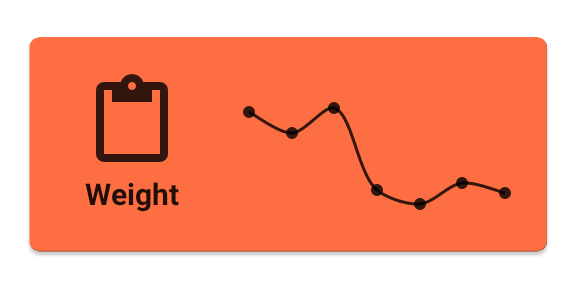

# data-plot-example
An Early version of a data plotting api library for Android

<h2>chart plotting example</h2>

This repo contains non-compilable code that is used by Tap Log to generate the spark chart shown in the image above. The orange square background, icon, and text are generated separately from the supplied package.